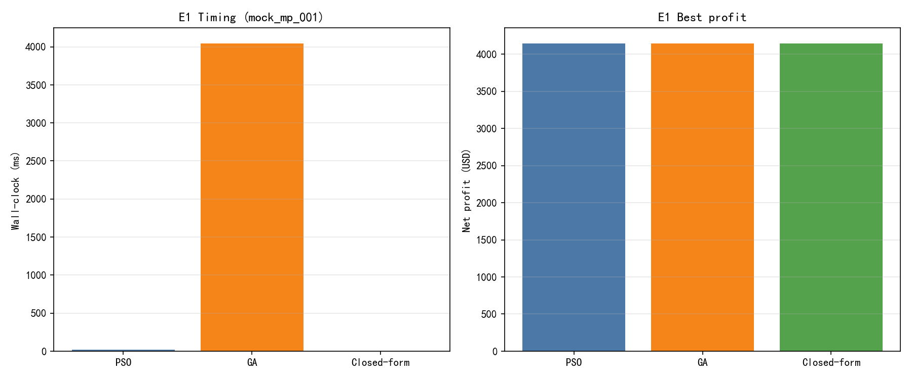
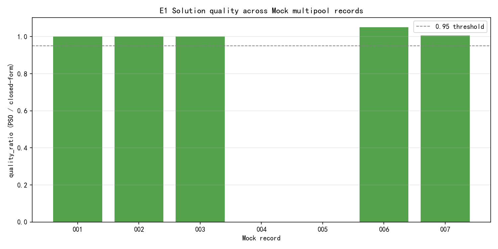
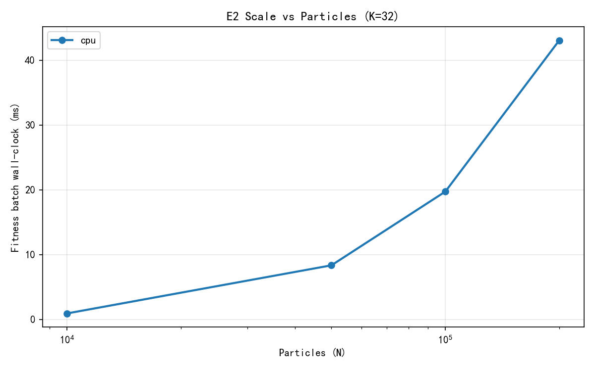
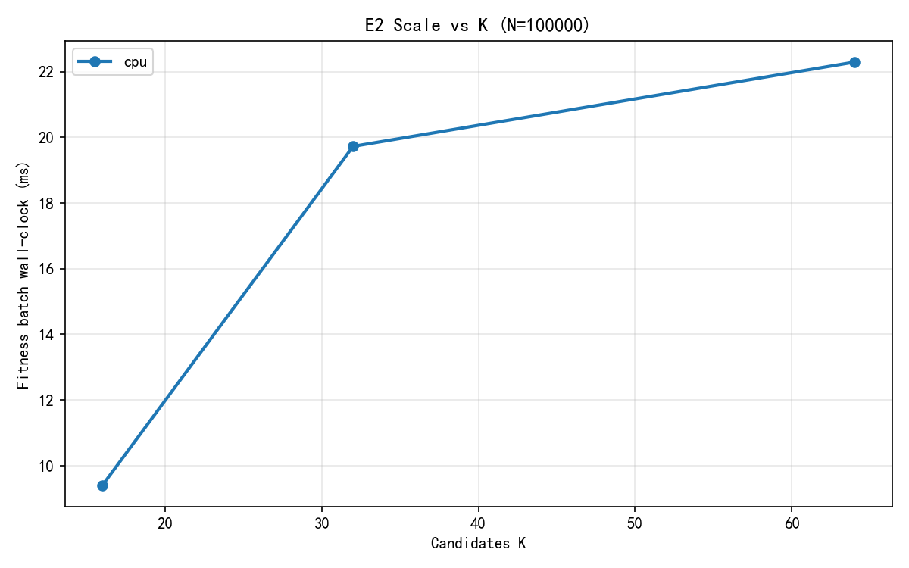

# 实验报告

> 库存约束下的跨层非原子多池套利机会检测  
> 课程：区块链技术与应用  
> 组员：李洁、刘双双、景麟喻  
> 日期：2026 年 6 月  
> 依据：[项目说明.md](./项目说明.md)、[最小闭环实施方案.md](./最小闭环实施方案.md)

---

## 摘要

本报告围绕 **L1（Ethereum）↔ L2（Arbitrum）跨层、非原子、多池**套利**机会检测**展开，研究对象并非单链 MEV 捕获。核心难点在于：跨层无法原子成交、套利者须在 L1/L2 分别持有库存、桥接时延引入风险项——由此形成带分层预算的混合优化问题，单池闭式解不再适用。

系统采用 **两阶段框架**：阶段1 在跨层 token-池图上用**负对数汇率**枚举路径、**可采纳松弛**过滤后取 Top-K 候选环；阶段2 以向量化 PSO 在 K 条候选上搜索最优投入量。PSO 定位为与问题结构匹配的实现工具；E1 以闭式/数值上界验证解质量。实验数据来自 **RPC 自建钉块多池快照**（真实）与 **Mock 多池消融**（算法），**二者分开报告**。

**主要结论：**

- **E1（Mock 消融）：** 7 条记录中 5 条可算 `quality_ratio`，范围 **1.0000～1.0501**（mean≈1.011）；GA/PSO 墙钟加速 **174×～542×**；PSO 相对闭式上界质量可靠。
- **E2（规模曲线）：** 单卡批量 fitness `[N,K]` 在 100k×32 时墙钟 **≈20 ms**，远低于 2 s 多卡门槛；**未进行** island 多卡实验（负结果预期，与系统设计方案一致）。
- **E3（真实快照）：** 7 条钉块快照中 **2/7** 检出正利润；USDC 主验真路由 **rel_error 0%～0.2%**（QuoterV2 + anvil fork）；**7/7** 快照已补全 **`l1_batch`**（L2→L1 祖先块映射）。
- **E4（威胁与限定）：** 本文是检测框架，不报 precision/recall；验真以 QuoterV2 钉块 + anvil fork 抽样为主（含 L1 state-changing swap）。

**关键词：** 跨层套利、非原子、多池路由、库存约束、两阶段检测、PSO、QuoterV2

---

## 1. 引言

### 1.1 背景与动机

去中心化交易所（DEX）上的套利是 MEV 的重要来源。MEVisor（NDSS 2025）等工作多聚焦**单链、单一交易对**——在该场景下最优投入量常存在闭式解，复杂搜索并非必需。

随着 L1 与 Arbitrum 等 L2 并行运行，同一资产在不同层、不同费率档池之间持续存在价格偏离。本课题关注被以往工作常绕过的结构：

| 结构 | 含义 | 建模后果 |
|------|------|----------|
| **非原子性** | L1↔L2 无法在一笔交易内完成 | 不能假设闪电贷「资本无穷」 |
| **分层库存约束** | L1、L2 须预先部署资金 | 投入量成为受限状态变量 |
| **桥接时延风险** | 跨层转移存在分钟～数日窗口 | 收益含时延惩罚项，非确定函数 |

### 1.2 问题形式

跨层多池路由形成 **混合整数、非凸、非光滑** 优化：离散层在多个平行池与桥路径间组合选择；连续层在 Uniswap V3 分段流动性上搜索投入量。传统梯度法不适用，元启发式搜索在此才**真正必要**。

### 1.3 研究目标与实验设计

| 编号 | 要回答的问题 |
|------|--------------|
| **E1** | 向量化 PSO 相对 GA 是否值得？解质量相对闭式上界如何？ |
| **E2** | 阶段2 批量 fitness 并行扩展至何处为止？ |
| **E3** | 真实快照上是否存在机会？模拟利润是否可信？ |
| **E4** | 结论适用范围与威胁限定是什么？ |

---

## 2. 系统与方法

### 2.1 两阶段框架

```
[L1/L2 多池真实快照 / Mock]
        │
        ▼
┌───────────────────────────────┐
│ 阶段1：候选环筛选（Top-K）     │
│ token 图 + 负对数汇率路径      │
│ 可采纳松弛 + 有效深度过滤      │
└───────────────┬───────────────┘
                ▼
┌───────────────────────────────┐
│ 阶段2：向量化 PSO 资金分配     │
│ 批量 fitness [N_particles, K] │
│ + 库存上界 + 时延风险 λ        │
└───────────────┬───────────────┘
                ▼
        [策略输出 + QuoterV2 / anvil fork 验真]
```

**阶段1 说明：**

- 实现 `src/stage1_graph.py`：L1/L2 池子双向边 + 同资产桥边，路径权重为 \(-\log r\)；BFS 枚举跨层 WETH→WETH 路径（≤6 hop），可采纳松弛（`admissible_relaxation_eps`、`depth_relaxation`）后取 Top-K。
- 配置 `CYCLE_FINDER_CONFIG['mode']='mvp'` 可回退笛卡尔积实现（对照/消融）。
- 除主池外，fitness 仍使用简化滑点；完整 tick 重建仅部分启用（`ticks_loaded` 多为 false）。
- 字段 `l1_batch` 存 **L2 块对应的 L1 祖先块号**（非 sequencer batch 序号）。

### 2.2 数据与验真分工

| 类型 | 路径 | 用途 |
|------|------|------|
| **真实快照** | `data/snapshots/*.json` | E3：机会是否存在 |
| **Mock 多池** | `data/mock_multipool/records.json` | E1：算法是否正确 |
| **QuoterV2 / fork 验真** | `data/results/fork_verify.jsonl` | 利润口径是否可信 |

**纪律：** Mock 利润**不作**市场发现统计；真实与 Mock **分开成节**；计时预热后报 mean±std；求解实验报告**解质量分布**。

### 2.3 池注册与跨层对齐

- L1/L2 各 **6** 个 Uniswap V3 高流动性池（WETH/USDC/USDT/DAI 等），见 `data/pool_registry.json`。
- 快照采集：`scripts/fetch_multi_pool_snapshot.py`，Multicall3 钉死 L1/L2 block。
- L2→L1 映射：`resolve_l1_batch()`（mixHash 解码 / ArbSys / NodeInterface）；2026-06-26 对 **7/7** 快照重拉后 **`l1_batch` 均已非 null**（与钉块 `l1_block` 可不同，见 §4.3.1）。

### 2.4 成本模型（阶段2）

$$\text{Fitness} = \text{SwapProfit} - \text{Gas}_{L1} - \text{Gas}_{L2} - \text{BridgeFee} - \lambda \cdot \text{latency\_hours} \cdot \text{exposure}$$

搜索上界：`amount_in ≤ min(inventory_l1_eth, inventory_l2_eth)`。

---

## 3. 实验设置

### 3.1 硬件与软件

| 项目 | 配置 |
|------|------|
| 平台 | Windows 10，AMD Ryzen AI 7 H 350，32 GB RAM |
| Python | 3.12.10 |
| PyTorch | 2.6.0+cu124（E1/E2/E3 实测 **CPU**） |
| web3.py | 7.16.0 |
| RPC | Infura Ethereum + Arbitrum HTTP |

> **【预留】E2 GPU 对照：** 本地 RTX 5060 与当前 PyTorch CUDA 构建不兼容；云主机 CPU/GPU 对照实验尚未重跑，见 §4.2。

### 3.2 实验编号与数据来源

| 编号 | 名称 | 数据来源 | 脚本 |
|------|------|----------|------|
| E1 | 算法对照 | `data/mock_multipool/`（7 条） | `scripts/run_e1_all_mock.py` |
| E2 | 规模曲线 | `mock_mp_001` 背景快照 | `scripts/benchmark_multipool_scale.py` |
| E3 | 检测与验真 | `data/snapshots/`（7 条） | `scripts/run_e3_detection.py`、`scripts/fork_verify_route.py` |
| E4 | 威胁与限定 | 文档 + λ 敏感性 | 见 §5 |

### 3.3 算法参数（E1 / E3 共用基线）

| 参数 | 数值 |
|------|------|
| 阶段1 Top-K | 32 |
| PSO 粒子数 | 1000 |
| 最大迭代 | E1: 80；E3: 80 |
| 预热 / 重复 | E1: warmup=2, repeats=2 |
| w / c1 / c2 | 0.7 / 1.5 / 1.5 |
| 随机种子 | 42 |
| 设备 | cpu |
| 默认库存 | L1/L2 各 50 ETH（可配置） |

---

## 4. 实验结果

### 4.1 E1：PSO vs GA vs 闭式上界（Mock 消融）

**命令：**

```bash
python scripts/run_e1_all_mock.py --particles 1000 --repeats 2 --warmup 2 --max-iter 80
```

**全量解质量分布**（`data/results/e1_solver_compare_all.json`；预热 2 次、重复 2 次，墙钟为 mean±std）：

| record | category | 闭式 ($) | PSO ($) | quality_ratio | PSO (ms) | GA (ms) | GA/PSO |
|--------|----------|----------|---------|---------------|----------|---------|--------|
| mock_mp_001 | profitable_pair | 4146.96 | 4147.00 | **1.0000** | 14.4±0.2 | 3895.2±6.4 | 271× |
| mock_mp_002 | profitable_pair | 3337.53 | 3337.56 | **1.0000** | 24.7±0.2 | 4297.3±5.6 | 174× |
| mock_mp_003 | profitable_pair | 2638.06 | 2638.08 | **1.0000** | 18.9±0.2 | 7484.9±73.4 | 396× |
| mock_mp_004 | no_opportunity | -20.18 | -20.18 | — | 8.6±0.2 | 4509.4±0.8 | 527× |
| mock_mp_005 | no_opportunity | -23.72 | -23.72 | — | 8.3±0.0 | 4502.0±13.0 | 542× |
| mock_mp_006 | latency_eats_profit | 55.31 | 58.08 | **1.0501** | 21.4±0.1 | 4514.1±1.2 | 210× |
| mock_mp_007 | latency_eats_profit | 237.05 | 238.54 | **1.0063** | 18.7±0.0 | 5288.0±38.8 | 283× |

**汇总：**

- 正利润可算 `quality_ratio`：**5/7**，min=**1.0000**，max=**1.0501**，mean≈**1.0113**
- 无机会 **2/7**：PSO / GA / 闭式均为负且一致
- GA 与 PSO **最优利润一致**（差异 < 0.1%），墙钟差 **2～3 个数量级** → 优势来自**向量化实现**，非 PSO 理论更优

**分析：**

1. Mock 上 PSO 与闭式上界高度一致，满足「解质量分布」要求。
2. `mock_mp_006` PSO 略高于闭式（+5%）属离散候选 + 有限迭代下的可接受偏差。
3. **Mock 仅用于算法验证**，不与 §4.3 真实结果合并。

**产出：** `data/results/e1_solver_compare_all.json`、`data/figures/e1_solver_compare.png`、`data/figures/e1_quality_ratio_all.png`



*图 4-1 E1 单条 Mock 对照：PSO / GA / 闭式上界（示例 `mock_mp_001`）*



*图 4-2 E1 解质量分布：`quality_ratio = PSO / 闭式`（7 条 Mock 记录）*

---

### 4.2 E2：单卡规模曲线（particles × K）

**命令：**

```bash
python scripts/benchmark_multipool_scale.py --cpu-only
```

**设定：** `mock_mp_001`；`N ∈ {1e4, 5e4, 1e5, 2e5}` × `K ∈ {16, 32, 64}`；预热后 mean±std。

| N | K=32 批量 fitness (ms) |
|---|------------------------|
| 10,000 | 0.92 |
| 50,000 | 8.35 |
| **100,000** | **19.73** |
| 200,000 | 43.06 |

**结论：**

1. 100k 粒子 × K=32 墙钟 **≈ 20 ms**，**未触发**实施方案约定的多卡 island 实验（门槛 > 2 s）。
2. 问题规模仍属毫秒级，**单卡/CPU 向量化已足够**；强行多卡分片预期负加速（与问题结构一致，符合实施方案对 E2 的约定）。
3. **【预留】** 云 GPU 上 `benchmark_multipool_scale.py`（不加 `--cpu-only`）CPU/CUDA 对照尚未完成。

**产出：** `data/E2-data/multipool_scale_curve.json`、`data/figures/e2_scale_curve.png`



*图 4-3 E2 批量 fitness 墙钟 vs 粒子数 N（K=32，`mock_mp_001` 背景）*



*图 4-4 E2 批量 fitness 墙钟 vs 候选数 K（N=50,000，CPU）*

---

### 4.3 E3：真实快照检测与 QuoterV2 验真

**命令：**

```bash
python scripts/fetch_multi_pool_snapshot.py --l1-block 25350500 --l2-block 475082500 --out data/snapshots/snap_batch_04.json
python scripts/run_e3_detection.py --particles 1000 --max-iter 80
python scripts/run_two_stage.py --snapshot data/snapshots/snap_batch_01.json
python scripts/fork_verify_route.py --snapshot data/snapshots/snap_batch_01.json --route-idx 4 --amount 0.01
python scripts/fork_verify_route.py --snapshot data/snapshots/snap_batch_01.json --route-idx 4 --amount 0.01 --swap-exec
```

#### 4.3.1 检测汇总

（`data/results/e3_detection_summary.json`，2026-06-26；快照于同日重拉以补全 `l1_batch`）

| 指标 | 数值 |
|------|------|
| 快照文件数 | **7**（含 1 组 idempotent 重复对照） |
| `l1_batch` 已填充 | **7 / 7** |
| PSO 正利润 | **2 / 7**（28.6%） |
| 净利润范围 | **-$6.87 ~ +$281.31** |
| PSO 墙钟 | **9.7～21.4 ms** |
| 阶段1 候选数 | **9～21**（图筛选后，≤ Top-K=32） |

| 文件 | L1 block | L2 block | **l1_batch** | PSO ($) | 闭式 ($) | ms | 正利润 | 最优路由 |
|------|----------|----------|--------------|---------|----------|-----|--------|----------|
| snap_batch_01 | 25350000 | 475080000 | **25350741** | **281.31** | 281.30 | 11.2 | 是 | DAI/Hop |
| snap_batch_03 | 25349500 | 475077500 | **25350689** | -6.87 | -6.87 | 9.7 | 否 | DAI/Hop |
| snap_batch_04 | 25350500 | 475082500 | **25350794** | **19.08** | 19.07 | 21.4 | 是 | DAI/Hop |
| snap_batch_05 | 25351000 | 475085000 | **25350846** | -6.28 | -6.28 | 18.1 | 否 | DAI/Hop |
| snap_idempotent_a/b | 25351081 | 475096183 | **25351080** | -5.10 | -5.10 | ~17 | 否 | 重复对照 |
| snap_latest | 25351392 | 475111152 | **25351392** | -6.84 | -6.84 | 10.4 | 否 | DAI/Hop |

**分析：**

1. 正利润具**时点依赖性**（25350000～25350500 区间 2 条机会）。
2. 闭式与 PSO 误差 **< 0.01%**，阶段2 质量可靠。
3. 正利润对应**大投入**（30～50 ETH，近库存上限）；小额扣 Gas+桥费为负，与 Quoter 一致。
4. **跨层对齐：** `l1_batch` 为 L2 块对应的 **L1 祖先块号**（`resolve_l1_batch`），与用于拉取 L1 池状态的钉块 `l1_block` **不必相等**（例：`batch_01` 钉 L1=25350000 而 l1_batch=25350741，差 +741）。±1 batch 敏感性见 §4.3.4。

#### 4.3.4 ±1 batch 敏感性（2026-06-26）

**方法：** 固定 L2 钉块与 L2 池状态，分别用 **原始钉块 `l1_block`（pinned）** 与 **`l1_batch−1 / l1_batch / l1_batch+1`** 重拉 L1 池，对每条快照跑 PSO（1000 粒子 × 80 迭代）及 USDC 路由 Quoter（0.01 ETH）。命令：`scripts/run_batch_sensitivity.py`；产出：`data/results/batch_sensitivity.json`。

**结论 1 — ±1 batch 内稳定：** 在 `l1_batch±1` 三档内，PSO 最优利润波动 **< $0.01**，**0/6 快照出现正负翻转**；USDC Quoter rel_error 维持 **≈0%**。

| 快照 | l1_batch | pinned L1 | batch−1 PSO | batch PSO | batch+1 PSO | batch 内 spread |
|------|----------|-----------|-------------|-----------|-------------|-----------------|
| batch_01 | 25350741 | 25350000 | -6.95 | -6.95 | -6.95 | **$0.00** |
| batch_03 | 25350689 | 25349500 | -6.83 | -6.83 | -6.82 | **$0.00** |
| batch_04 | 25350794 | 25350500 | +5.25 | +5.25 | +5.25 | **$0.00** |
| batch_05 | 25350846 | 25351000 | -6.86 | -6.86 | -6.86 | **$0.00** |
| idempotent_a | 25351080 | 25351081 | -5.10 | -5.10 | -5.10 | **$0.00** |
| latest | 25351392 | 25351392 | -6.84 | -6.84 | -6.84 | **$0.00** |

**结论 2 — pinned vs l1_batch 偏差更大：** E3 采集时 L1 池钉在 **`l1_block`**，与 L2 祖先块 **`l1_batch`** 可相差数百块；改用 `l1_batch` 对齐后，检测利润显著变化：

| 快照 | pinned PSO ($) | batch PSO ($) | Δ (batch − pinned) | 符号变化 |
|------|----------------|---------------|--------------------|----------|
| **batch_01** | **+281.31** | -6.95 | **−288.26** | **是**（正→负） |
| **batch_04** | **+19.08** | +5.25 | −13.83 | 否（仍正） |
| batch_03 | -6.87 | -6.83 | +0.05 | 否 |
| 其余 | 负 | 负 | < $0.6 | 否 |

**解读：** ±1 batch 映射误差对结论影响可忽略；但 **L1 钉块选 `l1_block` 还是 `l1_batch`** 会 materially 改变大价差检出（`batch_01` DAI +$281 仅在 pinned 口径下成立，batch 对齐后为负）。报告 E3 正利润案例应理解为「特定 L1/L2 钉块组合下的模型输出」，跨层对齐策略需在部署层明确约定。

**产出：** `data/results/batch_sensitivity.json`

#### 4.3.2 代表案例

**案例 A — `snap_batch_01`（L1=25350000，l1_batch=25350741）**

- PSO：**$281.31** @ **50.00 ETH**，11.2 ms；路由 **eth_dai_005 × arb_dai_005 / Hop**；DAI 价差约 **$8.89/ETH**
- 含义：检测模型在大库存下检出机会；**非**小额可成交建议
- **大额 Quoter 试跑（2026-06-26）：** 在 PSO 最优量级 **10～50 ETH** 上，L2 `quoteExactOutputSingle` **全部 revert**；**≥1 ETH** 即触发 **Quoter 上限**。检测利润 **+$281** 无法在 Quoter 口径下复核，见 §4.3.3。
- **batch 对齐（§4.3.4）：** 若 L1 池改钉在 `l1_batch` 而非原始 `l1_block`，同一 L2 块下 PSO 由 **+$281 → −$7**；±1 batch 本身影响 **< $0.01**。

**案例 B — `snap_batch_04`（L1=25350500）**

- PSO：**$19.08** @ **30.39 ETH**，15.5 ms；同路由、不同时点，利润分布不同

#### 4.3.3 Fork / QuoterV2 验真

**对照 §7.4 验收：** 对 ≥1 条 USDC 主验真路由完成 **QuoterV2 钉块** 与 **anvil `--fork` 同区块** 抽样；`rel_error < 10%`（实际 **< 0.2%**）。L1 可选 `--swap-exec` 执行 SwapRouter02 `exactInputSingle`（state-changing），L2 仍用 QuoterV2 钉块。

**验真范围与限定（须在结论中一并说明）：**

1. **三种模式**（`verification_mode`）：
   - `rpc_quoter`：RPC 钉块 QuoterV2 staticcall（无 anvil）
   - `anvil_quoter`：L1 anvil fork 同区块 + QuoterV2 两腿报价
   - `anvil_l1_swap_l2_quoter`：L1 fork 上真实 swap + L2 QuoterV2（推荐 state-changing 组合）
2. **金额尺度：** 验真在 **0.01～0.1 ETH** 小额进行；E3 检出的正利润出现在 **30～50 ETH** 大仓位（DAI/Hop）。小额下 Gas+桥费大于价差毛利，**模拟与 fork/Quoter 同为负利润**并不否定大仓位模型检出，二者回答的是不同尺度问题。
3. **路由币种：** **USDC 0.05%** 作为主验真路由（6 位小数、主池 Quoter 稳定）；**DAI** 仅作检测案例，Quoter 与简化模型偏差大（rel_error 50% 以上），**利润可信性主结论不依赖 DAI 验真**。
4. **DAI 正利润大额验真：** 已对 `snap_batch_01` DAI/Hop 在 **0.1～50 ETH** 试跑 QuoterV2；**≥1 ETH** 时 L2 买腿 revert（Quoter 上限），**50 ETH 检测利润无法 Quoter 复核**；L2 未做 anvil fork（MVP 设计）；未验证链上实际成交与 Bundle 竞争。

**主验真 — USDC 路由（QuoterV2 / anvil）：**

| 快照 | route | amount (ETH) | mode | sim ($) | fork ($) | rel_error |
|------|-------|--------------|------|---------|----------|-----------|
| batch_01 | usdc_005 × usdc_005 / hop | 0.01 | rpc_quoter | -6.76 | -6.76 | **0.00%** |
| batch_01 | 同上 | 0.01 | anvil_quoter | -6.76 | -6.76 | **0.00%** |
| batch_01 | 同上 | 0.01 | **anvil_l1_swap_l2_quoter** | -6.76 | -6.76 | **0.00%** |
| batch_01 | 同上 | 0.10 | rpc_quoter | -6.22 | -6.21 | **0.20%** |
| batch_01 | usdc_005 / canonical | 0.01 | rpc_quoter | -3.33 | -3.33 | **0.00%** |
| batch_04 | usdc_005 × usdc_005 / hop | 0.01 | rpc_quoter | -6.82 | -6.82 | **0.00%** |

**anvil 环境：** Foundry `anvil 1.7.1`；Infura Secret 经 `authenticated_fork_url()` 嵌入 `--fork-url`；L1 swap 使用 SwapRouter02（struct **无 deadline** 字段）。

**辅助 — DAI/Hop 路由（`snap_batch_01`，不作主结论）：**

| amount (ETH) | 模拟 ($) | Quoter ($) | rel_error | Quoter 状态 |
|--------------|----------|------------|-----------|-------------|
| 0.1 | -6.10 | -17.05 | **64.2%** | 两腿 OK |
| 0.5 | -3.24 | -465.17 | **99.3%** | 两腿 OK（18 位 DAI + 简化模型偏差极大） |
| 1.0 | — | — | — | **L2 买腿 revert**（`Unexpected error`） |
| 10 / 30 / 50（PSO 量级） | +62 / +183 / **+281** | — | **100%**（失败记 0） | **Quoter 上限**：L1 卖腿可报，L2 `quoteExactOutput` ≥1 ETH 失败 |

**Quoter 上限说明：** Uniswap QuoterV2 通过 `eth_call` 模拟 swap，跨 tick 过多或 call gas 不足时会 revert，**不等于链上不可成交**，但意味着离线验真无法覆盖该仓位。因此 **+$281 的 DAI 正利润仅保留为检测模型输出**，主结论仍依赖 USDC 小额验真（rel_error < 0.2%）。

- USDC **rel_error < 0.2%**（三种模式一致）→ 在验真尺度上，**成本与报价模块自洽**（支撑「利润口径可信」）
- `anvil_l1_swap_l2_quoter` 表明 L1 腿可在 fork 上 state-changing 执行，与 Quoter 口径一致
- DAI 大仓位检测利润与 Quoter **存在方法论断层**（检测用 mid-price 简化 + 大仓位；Quoter 在 DAI 池大额不可用），不构成 USDC 主结论的逻辑矛盾

**产出：** `data/results/e3_detection_summary.json`、`data/results/fork_verify.jsonl`

---

## 5. 威胁与限定（E4）

### 5.1 定位与评估边界

1. **检测 ≠ 捕获：** 本文实现跨层多池**机会检测**与资金分配搜索，**不是** MEV 捕获系统；不 claim 在竞争环境下能抢到区块空间。
2. **无真值标签：** 跨层非原子套利无公开标注数据集，**不报告** precision / recall；以 E1 闭式上界 + QuoterV2 抽样作一致性校验。
3. **Mock 与真实分离：** Mock（§4.1）仅算法消融；真实（§4.3）单独统计，不合并为「市场发现率」。

### 5.2 模型与验真限定

4. **阶段1 近似：** 负对数汇率基于 mid-price + 固定费率，非 tick 级；同链多跳路径受 `max_path_hops` 限制。
5. **滑点模型：** 除 QuoterV2 抽样外为简化估算；DAI 池 Quoter 在 **≥1 ETH** 触发 revert 上限，0.1～0.5 ETH 亦与简化模型偏差极大（rel_error 64%～99%）。
6. **验真范围：** 见 §4.3.3（QuoterV2 + anvil fork 小额、USDC 主证、L1 swap-exec 已跑通；未验真大仓位 DAI 正利润、L2 anvil）。
7. **多 GPU：** E2 表明单卡已毫秒级；多卡 island **不适用**（未做亦符合预期）。

### 5.3 λ 与库存敏感性

**时延风险系数 λ**（同一快照 `mock_mp_006`，闭式最优；仅改变 `latency_risk_lambda`）：

| λ | 闭式净利润 ($) | 最优投入 (ETH) | 相对 λ=0.01 |
|---|----------------|----------------|-------------|
| **0.01**（默认） | 58.07 | 5.6622 | 基准 |
| **0.03** | 57.28 | 5.6320 | −0.79 |
| **0.08** | 55.31 | 5.5564 | −2.76 |

**Mock 记录对照**（快照内嵌 λ，E1 PSO 最优）：

| Mock | 内嵌 λ | category | 闭式 ($) | PSO ($) |
|------|--------|----------|----------|---------|
| mock_mp_001 | 0.01 | profitable_pair | 4146.96 | 4147.00 |
| mock_mp_007 | 0.03 | latency_eats_profit | 237.05 | 238.54 |
| mock_mp_006 | 0.08 | latency_eats_profit | 55.31 | 58.08 |

**库存上限**（`mock_mp_001`，λ=0.01，闭式最优）：

| L1/L2 库存 (ETH) | 闭式净利润 ($) | 最优投入 (ETH) |
|------------------|----------------|----------------|
| 20 | 2981.46 | 20.0000（顶格） |
| 50（默认） | 4146.96 | 42.5488 |

λ 增大或库存收紧均降低可分配上界与净利润，与 `MultiPoolCostModel.latency_risk_lambda`、`get_multipool_search_bounds` 一致。

**桥接参数**（`BRIDGE_CONFIG`，fitness 用配置值，非实时链上报价）：

| bridge_id | 桥费 ($) | 时延 (hours) |
|-----------|----------|--------------|
| canonical | 2.0 | 168.0 |
| across | 8.0 | 0.05 |
| hop | 6.0 | 0.1 |

默认 `latency_risk_lambda = 0.01`。

### 5.4 标准表述（可引用）

> 本文将跨层非原子多池套利形式化为带分层库存与时延风险的优化问题，采用「候选环筛选 + 向量化 PSO 资金分配」两阶段框架。实验数据来自 RPC 自建多池快照（钉块）与 Mock 消融（分开报告）。利润以 QuoterV2 钉块 + anvil fork 抽样校验为准；本文定位为机会检测，不主张竞争环境下必然捕获 MEV。

---

## 6. 结论

1. **研究问题界定合理：** 多池 + 非原子 + 库存/时延使搜索必要；两阶段框架端到端可跑通。
2. **E1：** PSO 解质量相对闭式上界 **≥ 0.95**（5/7 可量化）；相对 GA 墙钟加速 **174×～542×**。
3. **E2：** 100k×K=32 批量 fitness **≈ 20 ms**；无需多卡，符合系统设计方案预期。
4. **E3：** 真实快照 **2/7** 正利润（DAI 大仓位模型）；USDC 主路由 **rel_error < 0.2%**；**7/7** 快照 **`l1_batch` 已补全**；DAI **50 ETH** 正利润 **Quoter 无法复核**（≥1 ETH 即达 Quoter 上限）。
5. **E4：** 检测边界、模型简化与验真范围已明确；±1 batch 敏感性已完成（§4.3.4）；完整 tick 重建列为后续工作。

### 6.1 后续工作（未完成项）

| 项 | 状态 |
|----|------|
| 云 GPU E2 CPU/CUDA 对照 | 【预留】 |
| L2 anvil fork / 全链路双链 state-changing | 【预留】 |
| 完整 tick 级仿真 | 【预留】 |
| L1 钉块策略（pinned vs l1_batch）统一约定 | 【预留】（敏感性见 §4.3.4） |
| DAI 大仓位 tick 级 / 链上 swap 验真 | 【预留】（QuoterV2 ≥1 ETH 已测失败，见 §4.3.3） |

---

## 7. 参考文献

1. MEVisor: High-Throughput MEV Discovery in DEXs with GPU Parallelism. NDSS 2025.
2. Kennedy J., Eberhart R. Particle Swarm Optimization. Proceedings of ICNN, 1995.
3. Adams H. et al. Uniswap v3 Core. 2021.
4. Arbitrum Docs: NodeInterface / L1 block number mapping.

---

## 附录 A：复现实验命令

```bash
.venv\Scripts\activate.bat

# 采集快照（钉块 + L2→L1 batch 映射）
python scripts/fetch_multi_pool_snapshot.py --l1-block 25350000 --l2-block 475080000 --out data/snapshots/snap_batch_01.json
python scripts/fetch_multi_pool_snapshot.py --latest --out data/snapshots/snap_latest.json

# E1
python scripts/run_e1_all_mock.py --particles 1000 --repeats 2 --warmup 2 --max-iter 80

# E2
python scripts/benchmark_multipool_scale.py --cpu-only

# E3
python scripts/run_e3_detection.py --particles 1000 --max-iter 80
python scripts/run_two_stage.py --snapshot data/snapshots/snap_batch_01.json
python scripts/fork_verify_route.py --snapshot data/snapshots/snap_batch_01.json --route-idx 4 --amount 0.01
python scripts/fork_verify_route.py --snapshot data/snapshots/snap_batch_01.json --route-idx 4 --amount 0.01 --swap-exec
python scripts/fork_verify_route.py --snapshot data/snapshots/snap_batch_04.json --route-idx 4 --amount 0.01

# DAI 正利润路由 Quoter 上限试跑（route-idx 1 = eth_dai_005 × arb_dai_005 / hop）
python scripts/fork_verify_route.py --snapshot data/snapshots/snap_batch_01.json --route-idx 1 --amount 0.1 --no-anvil
python scripts/fork_verify_route.py --snapshot data/snapshots/snap_batch_01.json --route-idx 1 --amount 50 --no-anvil

# E3 batch 敏感性
python scripts/run_batch_sensitivity.py

# 单元测试
python -m pytest tests/test_e1_solver_compare.py tests/test_batch_fitness.py tests/test_fork_verify.py -v
```

---

## 附录 B：图表与数据文件

正文插图使用 `docs/assets/`（便于 Markdown 预览）；原始产出在 `data/`。

| 文件 | 实验 |
|------|------|
| `docs/assets/fig-e1-quality-ratio.png` | E1 解质量分布 |
| `docs/assets/fig-e1-solver-compare.png` | E1 单条对照示例 |
| `docs/assets/fig-e2-scale-curve.png` | E2 N–墙钟（K=32） |
| `docs/assets/fig-e2-scale-vs-k.png` | E2 K–墙钟 |
| `data/results/e1_solver_compare_all.json` | E1 全表 JSON |
| `data/E2-data/multipool_scale_curve.json` | E2 JSON |
| `data/results/e3_detection_summary.json` | E3 |
| `data/results/fork_verify.jsonl` | E3 验真 |
| `data/results/batch_sensitivity.json` | E3 ±1 batch |
| `data/snapshots/*.json` | E3 真实快照 |
| `data/mock_multipool/records.json` | E1 Mock |

---

## 附录 C：可视化演示（可选）

早期单池 Streamlit 面板（`viz/dashboard.py`）可用于辅助展示监听与界面原型，**不纳入**本文实验结论。

```bash
streamlit run viz/dashboard.py
```

---

> 说明：早期探索性工作（单池 PSO vs GA、`tests/test_pso_vs_ga.py`；双链实时监听；自适应 PSO；多 GPU 扩展实验；Streamlit 可视化等）**已从正文移除**；相关代码与数据仍保留在仓库中供对照。
